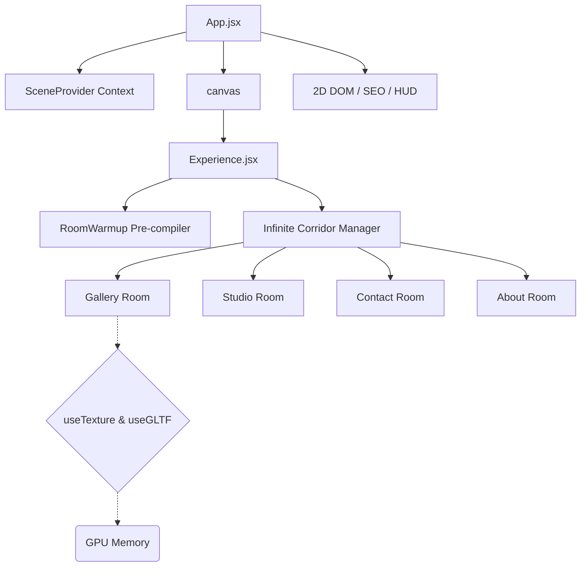

# 🎨 Ilyas Khan | Interactive 3D WebGL Portfolio

<div align="center">
  
  
  
  
  
</div>

<br/>

Welcome to the open-source repository of **Ilyas Khan's** interactive 3D Web Developer & AI/ML Portfolio. This project pushes the limits of modern web technologies by blending spatial WebGL computing, complex React ecosystems, and highly optimized frontend engineering.

> [!TIP]
> **Live Site:** [https://ilyaskhan12Q.github.io/portfoli0/](https://ilyaskhan12Q.github.io/portfoli0/)
> 
> **Interactive Resume:** Check out the fully customized [Ilyas_Khan_Resume.docx](file:///home/ilyaskhan/portfolio-itom/Ilyas_Khan_Resume.docx) in the root directory, featuring interactive hyperlinks to live projects and matching the timeline represented in this 3D experience.

> [!NOTE]
> Ensure hardware acceleration is enabled in your browser settings to experience the smooth 60 FPS high-tier rendering of this application.

---

## 🚀 Key Performance Architectures (2026 Standards)

This application is strictly optimized for cross-device operability, achieving zero lag spikes even on mobile processors through several bespoke architectural implementations:

1. **Invisible Semantic SEO Fallback:** Bypasses WebGL canvas SEO limitations via strategic `sr-only-seo` indexing DOM injections, rendering fully visible semantic trees to native search-engine crawlers without mounting heavy bundles.
2. **Asynchronous Shader Compilation:** Enforces `gl.compileAsync` during the Preloading phase inside a hidden `RoomWarmup` Suspense boundary. This allows Three.js to pre-compile complex materials asynchronously without blocking the main React update thread.
3. **Baked Global Tinting & Lighting Extraction:** Replaced real-time WebGL shadow maps and infinite light rays with baked-in global textures (`apply_global_tint.js`), dropping the GPU compute overhead entirely while maintaining visual depth.
4. **DOM Mutation Bypassing:** Critical animation properties (like SVG preloader states tracking 130+ concurrent HTTP texture requests) write directly to the `ref.current.style`, intentionally bypassing React’s `setState` render cycles to conserve CPU.
5. **Adaptive Device Tiering:** Auto-detects `navigator.deviceMemory`, hardware concurrency, and viewport sizes to scale WebGL resolutions (`dpr`), antialiasing algorithms, and texture loading strictness on the fly.

---

## 🏗️ 3D Scene Architecture



---

## 📂 Key Interactive Rooms & Syncs

*   **Gallery Room (`GalleryRoom.jsx`)**: Houses interactive canvas prints of core projects (APDD Drone, NeoHack 25 Cancer Classifier, SAB, etc.) with real, active link routing.
*   **Studio Room (`contentData.js`)**: Real-time content feeds, containing updated external links to blog posts, code repositories, and achievements.
*   **Contact Room (`ContactRoom.jsx`)**: A water-shader scene featuring bobbing interactive social barrels (LinkedIn, GitHub, Message, and Portfolio) updated with real URLs.
*   **About Room (`InfiniteSkyManager.jsx`)**: A floating sky mile corridor that tracks your education and career journey milestones dynamically.

---

## 🛠️ Local Development Setup

To run this application natively on your local machine:

1. **Clone the repository:**
   ```bash
   git clone https://github.com/ilyaskhan12Q/portfoli0.git
   cd portfoli0
   ```

2. **Install dependencies:**
   Make sure you are on Node.js v20+.
   ```bash
   npm install
   ```

3. **Start the local Dev Server:**
   ```bash
   npm run dev
   ```

> [!IMPORTANT]
   Since this project heavily utilizes `vite-plugin-compression` and hundreds of high-res textures, your initial local load might take a few seconds as the dev-server buffers asset delivery. For performance testing, always run `npm run build && npm run preview`.

## 🛰️ Continuous Deployment (GitHub Pages)

This project has a pre-configured **GitHub Actions Workflow** (`.github/workflows/deploy.yml`) that automatically builds and deploys your site to GitHub Pages whenever changes are pushed to the `main` branch. 

To enable this:
1. Ensure the remote repository is linked: `git remote add origin https://github.com/ilyaskhan12Q/portfoli0.git`
2. Push changes: `git push -u origin main`
3. Go to the repository **Settings** -> **Pages** on GitHub, and under **Build and deployment**, set **Source** to **GitHub Actions**.

## 🤝 Contributing & Feedback

All PRs improving the shader physics, 3D math logic, or component memoization runtimes are welcome.

1. Fork the Project
2. Create your Feature Branch (`git checkout -b feature/AmazingRoom`)
3. Commit your Changes (`git commit -m 'feat: Added realistic liquid simulation to Contact Room'`)
4. Push to the Branch (`git push origin feature/AmazingRoom`)
5. Open a Pull Request

---

*Designed and Developed by [Ilyas Khan](https://github.com/ilyaskhan12Q).*
